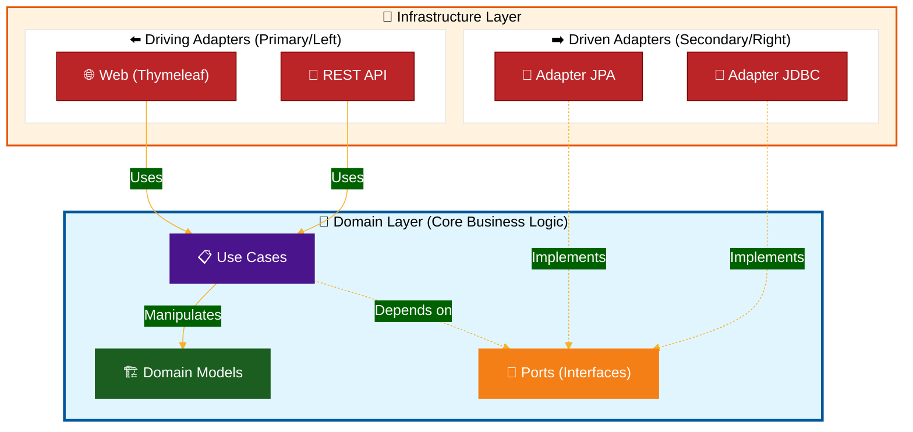

# DemoMyBank - Projet d'exemple

## 📋 Vue d'ensemble

Projet pédagogique démontrant la mise en œuvre d'une application bancaire simplifiée avec Spring Boot et une
architecture hexagonale (Ports & Adapters).

L'application permet de gérer des clients bancaires et leurs comptes bancaires avec des opérations CRUD via une API REST
entièrement documentée avec Swagger/OpenAPI.

## 🏗️ Architecture

### Architecture Hexagonale (Ports & Adapters)

Ce projet suit les principes de l'**architecture hexagonale** (aussi appelée Ports & Adapters), qui vise à isoler le
domaine métier des détails d'implémentation technique.



**Légende :**

- **🎯 Domain Layer** : Cœur métier, indépendant de toute technologie
- **⬅️ Driving Adapters** : Points d'entrée (Web, REST API)
- **➡️ Driven Adapters** : Points de sortie (Base de données, Services externes)
- **🔌 Ports** : Interfaces définissant les contrats
- **➡️ Flèches pleines** : Dépendances directes
- **⤏ Flèches pointillées** : Implémentation d'interface

### Structure du projet

```
src/main/
├── java/com/example/mybank/
│   ├── domain/                          # Couche Domaine (cœur métier)
│   │   ├── model/                       # Modèles du domaine
│   │   ├── ports/                       # Interfaces (contrats)
│   │   │   ├── driven/
│   │   └── usecase/                     # Cas d'usage métier
│   │       ├── client/
│   │       └── account/
│   │
│   ├── infrastructure/                  # Couche Infrastructure
│   │   ├── application/                 # Configuration de l'application
│   │   │   └── config/
│   │   │       └── UseCaseConfiguration.java
│   │   ├── driven/                      # Adaptateurs sortants (bases de données, etc.)
│   │   │   ├── jpa/                     # Entités JPA et repositories
│   │   │   └── jdbc/                    # Implémentation JDBC
│   │   └── driving/                     # Adaptateurs entrants (API, UI, etc.)
│   │       ├── web/                     # Contrôleurs web (Thymeleaf)
│   │       └── rest/
│   │           ├── GlobalExceptionHandler.java
│   │           └── dto/                 # Data Transfer Objects
│   │
│   └── DemoMyBankApplication.java       # Point d'entrée Spring Boot
│
├── resources/
│   ├── templates/                       # Templates Thymeleaf
│   │   └── error/                       # Pages d'erreur personnalisées
│   ├── static/                          # Ressources statiques (JS, CSS)
│   │   └── js/
│   └── db/changelog/                    # Migrations Liquibase
```

### Principes appliqués

1. **Séparation des préoccupations** : Le domaine métier est complètement isolé de l'infrastructure
2. **Inversion de dépendances** : L'infrastructure dépend du domaine, jamais l'inverse
3. **Ports** : Interfaces définissant les contrats (`ClientRepository`, `AccountRepository`)
4. **Adapters** : Implémentations concrètes (JPA, REST Controllers, etc.)
5. **Value Objects** : Objets immuables encapsulant la logique métier (`Client.Name`, `Client.Id`, `Amount`)
6. **Records Java** : Utilisation des records pour des modèles immuables et concis
7. **DTOs** : Séparation entre les modèles du domaine et les représentations API

## 🛠️ Technologies et outils

### Framework & Langage

- **Java 25** : Version moderne du langage avec support des records et pattern matching
- **Spring Boot 4.0.0** : Framework d'application avec autoconfiguration
    - `spring-boot-starter-web` : Pour l'API REST et serveur web
    - `spring-boot-starter-thymeleaf` : Moteur de templates pour le rendu HTML côté serveur
    - `spring-boot-starter-logging` : Gestion des logs (SLF4J + Logback)
    - `spring-boot-starter-validation` : Validation Bean Validation (JSR-303)
    - `spring-boot-starter-data-jpa` : ORM avec Hibernate
    - `spring-boot-starter-jdbc` : Accès aux bases de données
    - `spring-boot-devtools` : Rechargement automatique en développement
    - `spring-boot-docker-compose` : Intégration Docker Compose

### Frontend

- **Thymeleaf** : Moteur de templates Java pour le rendu server-side
- **Alpine.js 3.x** : Framework JavaScript réactif minimaliste (~15kb)
- **Pico CSS 2** : Framework CSS sans classes pour un design moderne
- **Fetch API** : Communication AJAX avec l'API REST

### Build & Gestion de dépendances

- **Gradle 8.x** (Kotlin DSL) : Outil de build moderne avec gestion des dépendances
- **Gradle Wrapper** : Version de Gradle incluse dans le projet pour reproductibilité

### Bibliothèques principales

- **ULID Creator** (`com.github.f4b6a3:ulid-creator:5.2.3`) : Génération d'identifiants ULID (ULIDv1, triables
  chronologiquement, alternartive aux UUID)
- **Jakarta Validation** : Support de la validation Bean Validation (JSR-303)
- **SpringDoc OpenAPI** (`springdoc-openapi-starter-webmvc-ui:2.8.13`) : Génération automatique de la documentation
  Swagger/OpenAPI avec interface Swagger UI
- **Spring Data JPA** : ORM pour la persistence des données avec Hibernate
- **PostgreSQL Driver** : Driver JDBC pour PostgreSQL
- **Liquibase** : Gestion des migrations de base de données (versioning du schéma)

### Infrastructure

- **Docker Compose** : Orchestration des conteneurs
- **PostgreSQL 15.2** : Base de données relationnelle

## 🚀 Démarrage rapide

### Prérequis

- Java 25 ou supérieur
- Docker et Docker Compose
- Git

### Installation et exécution

#### 1. Cloner le projet

```bash
git clone <repository-url>
cd demoMyBank
```

#### 2. Lancer les services Docker (optionnel)

```bash
docker-compose up -d
```

Cela démarre PostgreSQL sur le port 5432 avec les credentials :

- Utilisateur : `myuser`
- Base de données : `mydatabase`
- Mot de passe : `secret`

#### 3. Lancer l'application

**Option 1 : Avec Gradle Wrapper (recommandé)**

```bash
./gradlew bootRun
```

**Option 2 : Compiler et exécuter**

```bash
./gradlew build
java -jar build/libs/demoMyBank-0.0.1-SNAPSHOT.jar
```

**Option 3 : Depuis l'IDE IntelliJ IDEA**

- Clic droit sur `DemoMyBankApplication.java` → Run

L'application démarre sur **http://localhost:8080**

#### 4. Vérifier que l'application fonctionne

```bash
curl http://localhost:8080/api/clients
```

Ou simplement ouvrir **http://localhost:8080** dans votre navigateur.

## 🎨 Interface Web

### Technologies Frontend

L'application dispose d'une **interface web moderne** construite avec :

- **Thymeleaf** : Moteur de templates côté serveur pour le rendu HTML
- **Alpine.js 3.x** : Framework JavaScript léger pour l'interactivité (alternative à Vue.js/React)
- **Pico CSS 2** : Framework CSS minimaliste sans classes pour un design élégant
- **Fetch API** : Appels AJAX vers l'API REST

### Pages disponibles

#### 1. Page d'accueil - Liste des clients (`/`)

**Rendu** : Server-side avec Thymeleaf  
**Features** :

- Affichage de tous les clients dans un tableau
- Lien vers la page des comptes de chaque client
- Navigation simple et intuitive

**Template** : `src/main/resources/templates/index.html`

#### 2. Page des comptes (`/clients/{clientId}/accounts`)

**Rendu** : Client-side avec Alpine.js  
**Features** :

- Récupération automatique du `clientId` depuis l'URL
- Liste dynamique des comptes du client
- Formulaire de création de compte avec validation
- États de chargement et gestion d'erreurs
- Mise à jour en temps réel après création

**Template** : `src/main/resources/templates/accounts.html`

#### 3. Pages d'erreur personnalisées

- **404 Not Found** : `/error/404`
- **500 Server Error** : `/error/500`
- **Erreur générique** : `/error/generic`

Redirection automatique depuis JavaScript en cas d'erreur API.

### Gestion des erreurs côté client

Le fichier `app.js` contient une fonction utilitaire `fetchWithRedirect()` qui :

- Gère automatiquement les erreurs HTTP
- Redirige vers les pages d'erreur appropriées
- Supporte les appels avec ou sans redirection

```javascript
async function fetchWithRedirect(url, options = {}, withRedirect = true) {
    try {
        const res = await fetch(url, options);
        if (!res.ok) {
            // Redirection automatique selon le code HTTP
            if (res.status === 404) window.location.href = '/error/404';
            if (res.status >= 500) window.location.href = '/error/500';
        }
        return res.json();
    } catch (e) {
        // Erreur réseau ou CORS
        window.location.href = '/error/generic';
    }
}
```

## 🔗 URLs Utiles

### Interface Web (Frontend)

| URL                                                   | Description                                |
|-------------------------------------------------------|--------------------------------------------|
| **http://localhost:8080/**                            | 🏠 Page d'accueil - Liste des clients      |
| **http://localhost:8080/clients/{clientId}/accounts** | 💰 Page de gestion des comptes d'un client |

### Documentation et Exploration de l'API

| URL                                        | Description                                                       |
|--------------------------------------------|-------------------------------------------------------------------|
| **http://localhost:8080/swagger-ui.html**  | 🔍 Interface Swagger UI - Exploration et test interactif de l'API |
| **http://localhost:8080/v3/api-docs**      | 📄 Documentation OpenAPI au format JSON                           |
| **http://localhost:8080/v3/api-docs.yaml** | 📄 Documentation OpenAPI au format YAML                           |

### Endpoints de l'application

| Méthode | Endpoint                           | Description                    | Codes de réponse |
|---------|------------------------------------|--------------------------------|------------------|
| `GET`   | `/api/clients`                     | Lister tous les clients        | 200              |
| `POST`  | `/api/clients`                     | Créer un nouveau client        | 201, 400, 409    |
| `GET`   | `/api/clients/{clientId}/accounts` | Lister les comptes d'un client | 200              |
| `POST`  | `/api/clients/{clientId}/accounts` | Créer un compte pour un client | 201, 400, 404    |

## 📡 Détails des Endpoints API

### 1. Lister tous les clients

```http
GET /api/clients
Content-Type: application/json
```

**Réponse** : `200 OK`

```json
[
  {
    "id": "01JDEXAMPLE123456789",
    "lastName": "Public",
    "firstName": "Client"
  }
]
```

### 2. Créer un nouveau client

```http
POST /api/clients
Content-Type: application/json

{
  "lastName": "Public",
  "firstName": "Client"
}
```

**Réponse** : `201 CREATED`

```json
{
  "id": "01JDEXAMPLE123456789",
  "lastName": "Public",
  "firstName": "Client"
}
```

**Erreurs possibles** :

- `400 Bad Request` : Données invalides (ex: champs vides ou invalides)
  ```json
  {
    "timestamp": "2025-11-26T10:30:00Z",
    "status": 400,
    "error": "Bad Request",
    "message": "Validation failed",
    "path": "/api/clients",
    "validationErrors": {
      "firstName": "must not be blank",
      "lastName": "must not be blank"
    }
  }
  ```
- `409 Conflict` : Client déjà existant avec ce nom et prénom
  ```json
  {
    "timestamp": "2025-11-26T10:30:00Z",
    "status": 409,
    "error": "Conflict",
    "message": "Client already exists: Public Client",
    "path": "/api/clients",
    "validationErrors": null
  }
  ```

### 3. Lister les comptes d'un client

```http
GET /api/clients/{clientId}/accounts
Content-Type: application/json
```

**Paramètres** :

- `clientId` (path) : ID ULID du client (ex: 01JDEXAMPLE123456789)

**Réponse** : `200 OK`

```json
[
  {
    "id": "01JDEXAMPLE123456789",
    "name": "Compte courant",
    "type": "COMPTE_COURANT",
    "amountCents": 150000
  }
]
```

### 4. Créer un compte pour un client

```http
POST /api/clients/{clientId}/accounts
Content-Type: application/json

{
  "name": "Compte courant",
  "type": "COMPTE_COURANT",
  "amountCents": 0
}
```

**Paramètres** :

- `clientId` (path) : ID ULID du client
- `name` (body) : Nom du compte (string)
- `type` (body) : Type de compte - valeurs autorisées : `COMPTE_COURANT`, `LIVRET_A`, `LDD`, `PEA`, `CTO`, `PEL`
- `amountCents` (body) : Montant en centimes (long)

**Réponse** : `201 CREATED`

```json
{
  "id": "01JDEXAMPLE987654321",
  "name": "Compte courant",
  "type": "COMPTE_COURANT",
  "amountCents": 0
}
```

**Erreurs possibles** :

- `400 Bad Request` : Données invalides
- `404 Not Found` : Client non trouvé

### Fichiers de test HTTP

Les requêtes sont disponibles dans `doc/api/client.http` pour une utilisation avec :

- **IntelliJ IDEA REST Client** (intégré à l'IDE)
- **VS Code REST Client** (extension)

## 🎯 Concepts clés pour le cours

### 1. Architecture Hexagonale

L'architecture hexagonale permet de :

- Isoler le domaine métier des détails techniques
- Tester le domaine indépendamment de l'infrastructure
- Changer facilement d'implémentation (ex: passer de InMemory à PostgreSQL/JPA)
- Respecter les principes SOLID (notamment le **DIP** - Dependency Inversion Principle)
- Favoriser la maintenabilité et l'évolutivité

### 2. Domain-Driven Design (DDD)

- **Entités** : `Client`, `Account` avec une identité unique
- **Value Objects** : `Client.Name`, `Client.Id`, `Amount` (immuables, comparés par valeur)
- **Use Cases** : Logique métier encapsulée (`CreateClient`, `ListClients`, `CreateAccount`, `ListAccounts`)
- **Repository Pattern** : Abstraction de la persistence (`ClientRepository`, `AccountRepository`)
- **Exceptions métier** : `ClientAlreadyExistsException` pour les règles métier violées

### 3. Patterns utilisés

- **Dependency Injection** : Via Spring (`@Bean`, `@Configuration`, `@Autowired`)
- **Repository Pattern** : Interface `ClientRepository` (port) avec implémentations (adapters)
- **DTO Pattern** : Séparation entre modèles du domaine (`Client`, `Account`) et représentations API (`ClientDTO`,
  `AccountDTO`)
- **Exception Handler Pattern** : Gestion centralisée avec `@RestControllerAdvice`
- **Adapter Pattern** : Controllers, Services, Repositories comme adaptateurs
- **Strategy Pattern** : Implémentations multiples possible du Repository

### 4. Records Java

Les records simplifient la création de classes immuables :

```java
public record Client(Id id, Name lastName, Name firstName) {
    // Validation dans le compact constructor
    public Client {
        Objects.requireNonNull(id, "id is required");
        // ...
    }
}
```

**Avantages** :

- Immutabilité par défaut
- `equals()`, `hashCode()`, `toString()` générés automatiquement
- Code plus concis et lisible
- Meilleur support pour les patterns matching (Java 16+)

### 5. Value Objects

Les Value Objects encapsulent des domaines de valeur avec :

- **Immuabilité** : Pas de setters, données finales
- **Validation** : Dans le constructeur
- **Comparaison par valeur** : Basée sur le contenu, pas la référence
- **Isolation** : Logique métier encapsulée

Exemple :

```java
public record Amount(long value) {
    public Amount {
        if (value < 0) {
            throw new IllegalArgumentException("Amount cannot be negative");
        }
    }
}
```

## 🧪 Commandes utiles

### Build et compilation

```bash
# Compiler le projet
./gradlew build

# Compiler sans les tests
./gradlew build -x test

# Nettoyer les artifacts compilés
./gradlew clean
```

### Exécution

```bash
# Démarrer l'application en mode développement
./gradlew bootRun

# Démarrer l'application en production (JAR)
java -jar build/libs/demoMyBank-0.0.1-SNAPSHOT.jar --server.port=9000
```

### Tests

```bash
# Exécuter tous les tests
./gradlew test

# Exécuter un test spécifique
./gradlew test --tests "com.example.mybank.DemoMyBankApplicationTests"
```

### Docker Compose

```bash
# Démarrer tous les services
docker-compose up -d

# Arrêter tous les services
docker-compose down

# Voir les logs
docker-compose logs -f

# Redémarrer un service spécifique
docker-compose restart database
```

## 🏆 Bonnes pratiques appliquées

✅ **Clean Code** : Noms explicites, petites fonctions, une responsabilité par classe  
✅ **SOLID Principles** : SRP, OCP, LSP, ISP, DIP  
✅ **Architecture propre** : Séparation couches, inversion des dépendances  
✅ **Immutabilité** : Records, Value Objects immuables  
✅ **Validation** : Règles métier centralisées dans le domaine  
✅ **Documentation** : Swagger/OpenAPI
✅ **Logging** : Logs structurés, niveaux appropriés  
✅ **Gestion d'erreurs** : Exceptions métier, handling centralisé

## 📚 Ressources

### Architecture et Design

- [Architecture Hexagonale - Alistair Cockburn](https://alistair.cockburn.us/hexagonal-architecture/)
- [Domain-Driven Design - Eric Evans](https://www.domainlanguage.com/ddd/)
- [Refactoring Guru - Design Patterns](https://refactoring.guru/design-patterns)

### Technologies Backend

- [Spring Boot Documentation](https://spring.io/projects/spring-boot)
- [Spring Data JPA](https://spring.io/projects/spring-data-jpa)
- [Thymeleaf Documentation](https://www.thymeleaf.org/documentation.html)
- [SpringDoc OpenAPI](https://springdoc.org/)
- [ULID Specification](https://github.com/ulid/spec)
- [PostgreSQL Documentation](https://www.postgresql.org/docs/)
- [Liquibase Documentation](https://docs.liquibase.com/)

### Technologies Frontend

- [Alpine.js Documentation](https://alpinejs.dev/)
- [Alpine.js GitHub](https://github.com/alpinejs/alpine)
- [Pico CSS Documentation](https://picocss.com/)
- [MDN - Fetch API](https://developer.mozilla.org/en-US/docs/Web/API/Fetch_API)

### Bonnes pratiques

- [The Twelve-Factor App](https://12factor.net/)
- [Clean Code - Robert C. Martin](https://www.oreilly.com/library/view/clean-code-a/9780136083238/)
- [Building Microservices - Sam Newman](https://samnewman.io/books/building_microservices_2nd_edition/)

## 📋 Checklist de démarrage pour les développeurs

- [ ] Java 25+ installé et configuré
- [ ] Gradle Wrapper fonctionne (`./gradlew --version`)
- [ ] Docker Desktop en cours d'exécution
- [ ] `docker-compose up -d` exécuté
- [ ] Application lancée avec `./gradlew bootRun`
- [ ] Interface web accessible à http://localhost:8080/
- [ ] Swagger accessible à http://localhost:8080/swagger-ui.html
- [ ] Premier endpoint API testé (ex: GET /api/clients)
- [ ] Page des comptes testée avec un clientId valide
- [ ] Alpine.js fonctionne correctement (interactivité sur la page des comptes)
- [ ] IDE configuré avec les bons settings
- [ ] Gradle et dépendances synchronisées

---